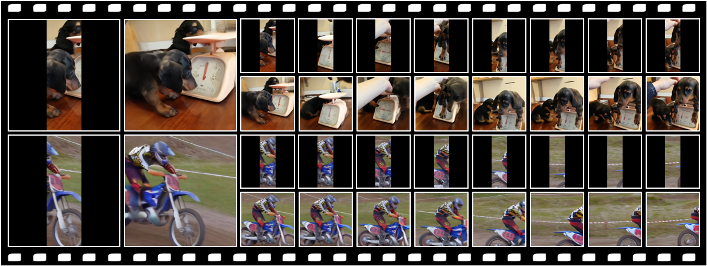
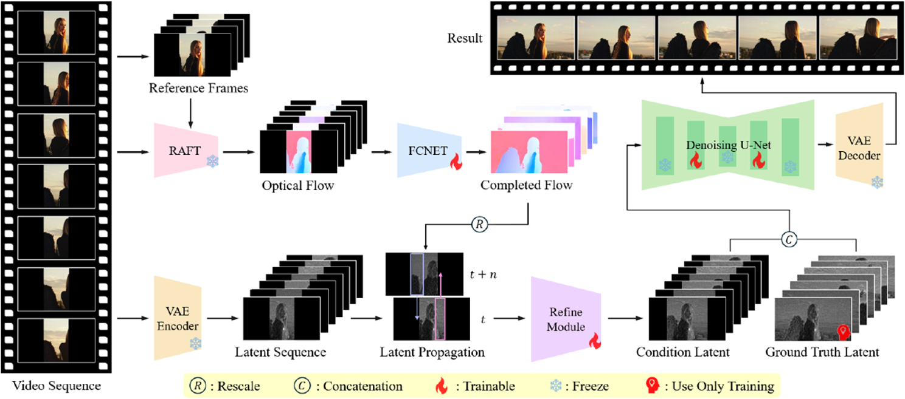
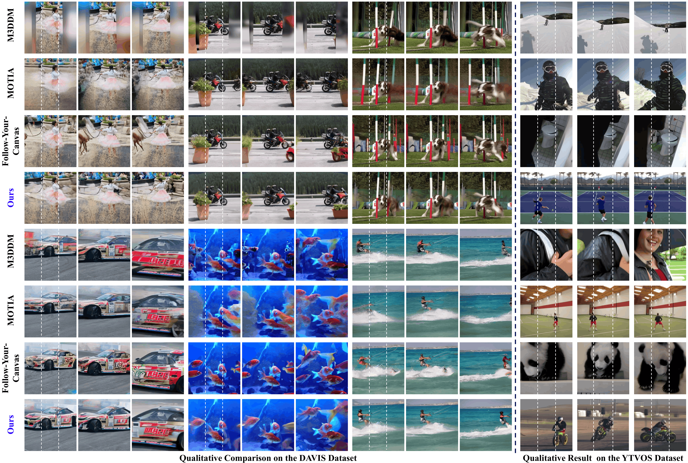

# Seen-to-Scene: Keep the Seen, Generate the Unseen for Video Outpainting

<p align="center">
IEEE/CVF Conference on Computer Vision and Pattern Recognition (CVPR) 2026
<br>
<b>Findings Paper 📝</b>
</p>

<p align="center">
<b>InSeok Jeon</b>, Minhyeok Lee, Seunghoon Lee, Minseok Kang, Suhwan Cho, Sangyoun Lee
</p>

<p align="center">
Yonsei University &nbsp;&nbsp; GenGenAI
</p>

<p align="center">
<a href="https://arxiv.org/pdf/2604.14648">Paper</a>
</p>

---

## Teaser

<p align="center">
  
</p>

**Seen-to-Scene** is a unified video outpainting framework that keeps the observed content consistent across frames while generating plausible unseen regions beyond the original video boundaries.

---

## Overview

Video outpainting aims to expand the visible content of a video beyond its original frame boundaries while preserving spatial fidelity and temporal coherence across frames. Existing methods are mainly based on either propagation-based approaches or generation-based approaches.

Propagation-based methods can preserve observed content by warping neighboring frames, but they suffer from high computational cost and unreliable flow completion when applied to large outpainting regions. Generation-based methods, especially diffusion-based models, can synthesize plausible new content, but they often suffer from limited spatial context and implicit temporal modeling, leading to source content drift, contextual hallucination, and temporal inconsistency.

In this paper, we propose **Seen-to-Scene**, a novel framework that unifies propagation-based and generation-based paradigms for video outpainting. Our method combines the source-preserving ability of flow-based propagation with the generative capability of video diffusion models. Specifically, Seen-to-Scene introduces **reference-guided latent propagation**, which propagates source content in the latent space using informative reference frames. To improve propagation reliability, we further fine-tune a flow completion network for video outpainting and introduce a lightweight latent refinement module to mitigate propagation artifacts.

Extensive experiments demonstrate that Seen-to-Scene achieves superior visual fidelity, temporal coherence, and inference efficiency, outperforming previous state-of-the-art methods even without input-specific adaptation.

---

## Method

<p align="center">
  
</p>

Our framework consists of:

- Reference frame selection
- Optical flow estimation
- Flow completion network
- Reference-guided latent propagation
- Latent alignment refinement module
- Diffusion-based video outpainting model
- VAE decoder for video reconstruction

Given an input video, Seen-to-Scene first selects informative reference frames based on structural correlation. Optical flow is then estimated between input frames and reference frames, followed by flow completion for the outpainting regions. Instead of performing expensive pixel-level sequential propagation, our method propagates visual information directly in the latent space.

The propagated latents provide strong spatial and temporal guidance to the video diffusion model, enabling the model to preserve observed content while generating coherent unseen regions.

---

## Qualitative Results

<p align="center">
  
</p>
The left side of the figure shows a quantitative comparison with existing state-of-the-art methods on the DAVIS benchmark, whereas the right side presents qualitative results of our method on YouTube-VOS. Seen-to-Scene produces visually coherent and temporally consistent outpainting results across diverse and challenging scenarios, including dynamic objects, camera motion, and complex motion patterns. Compared with previous methods, our approach better preserves the original source content while generating plausible unseen regions.

---

## Video Results

<p align="center">
  
</p>

Video outpainting results of **Seen-to-Scene** across challenging real-world videos. Our method maintains strong spatio-temporal consistency without requiring input-specific adaptation.

---

## Installation

### Environment

- Python 3.8+
- PyTorch
- torchvision
- diffusers
- transformers
- accelerate
- numpy
- opencv-python
- pillow

---

## Model Preparation

Our implementation is based on a pre-trained video diffusion model:

```text
stabilityai/stable-video-diffusion-img2vid-xt-1-1
```

In addition to the video diffusion model, Seen-to-Scene requires RAFT weights for optical flow estimation and ProPainter recurrent flow completion weights for flow completion.

Therefore, please prepare the following three checkpoints before running training or inference:

1. Stable Video Diffusion checkpoint  
2. <a href="https://github.com/princeton-vl/raft">RAFT</a> checkpoint for flow estimation  
3. <a href="https://github.com/sczhou/ProPainter">ProPainter</a> recurrent flow completion checkpoint  

---

## Dataset Preparation

### Training Dataset

Seen-to-Scene is trained on video samples from the publicly available YouTube-VOS training set.

Please organize the training dataset as follows:

```text
dataset/
    YouTube-VOS/
        train/
            ...
```

Modify dataset paths in the configuration file or training script if necessary.

---

### Evaluation Benchmark

We evaluate Seen-to-Scene on:

- [DAVIS](https://davischallenge.org/)
- [YouTube-VOS](https://youtube-vos.org/)

Following [Follow Your Canvas](https://github.com/mayuelala/FollowYourCanvas), we conduct evaluation with masking ratios of **0.33** and **0.125**.  
Please refer to FollowYourCanvas for more details on the evaluation protocol and dataset preparation.

Please organize the evaluation datasets as follows:

```text
dataset/
    DAVIS/
        ...
    YouTube-VOS/
        ...
```
---

## Training

To train Seen-to-Scene:

```bash
python train.py
```

Please modify dataset paths, output paths, and training configurations before running the script.

---

## Inference

To run inference on a single video:

```bash
python test.py 
```
Before running inference, please modify the arguments in the test script according to your own paths and settings.

In addition, we provide separate test files for long and short videos:

```bash
python test_long_video.py
python test_short_video.py 
```
---


## Citation

If you find this work useful for your research, please consider citing our paper.

```bibtex
@article{jeon2026seen,
  title={Seen-to-Scene: Keep the Seen, Generate the Unseen for Video Outpainting},
  author={Jeon, Inseok and Lee, Minhyeok and Lee, Seunghoon and Kang, Minseok and Cho, Suhwan and Lee, Sangyoun},
  journal={arXiv preprint arXiv:2604.14648},
  year={2026}
}
```

---

## License

This project is released under the MIT License.

---

## Acknowledgements

We sincerely thank [FollowYourCanvas](https://github.com/mayuelala/FollowYourCanvas) for providing the dataset and benchmark for video outpainting research. We also gratefully acknowledge [RGVI](https://github.com/suhwan-cho/rgvi) and [FFF-VDI](https://github.com/Hydragon516/FFF-VDI), which provided valuable inspiration for our work. In addition, our implementation benefits from the open-source contributions of [RAFT](https://github.com/princeton-vl/RAFT) for optical flow estimation and [ProPainter](https://github.com/sczhou/ProPainter) for flow completion. We thank the authors and the research community for their valuable contributions.

---

## Contact

If you have any questions about the code or the paper, please feel free to contact:

**InSeok Jeon**  
Email: sunlight3919@yonsei.ac.kr
